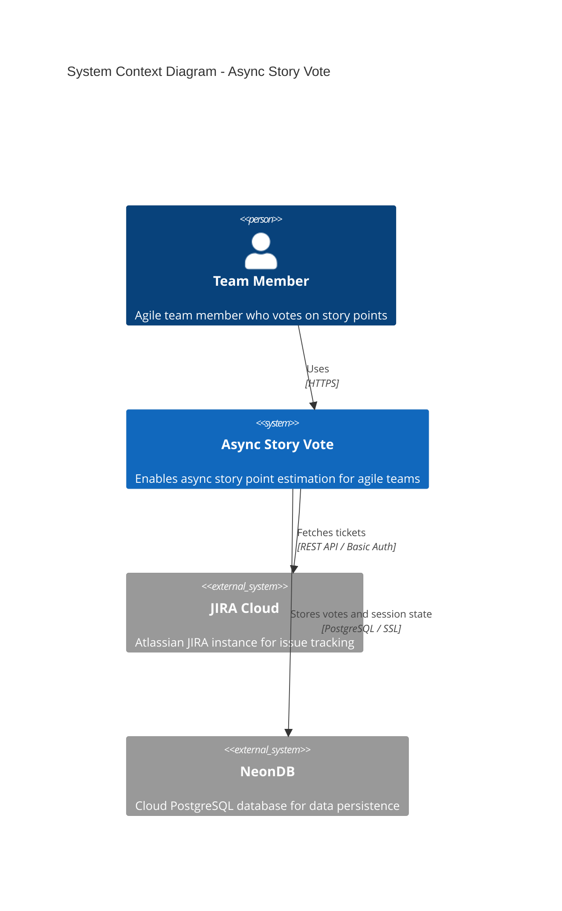
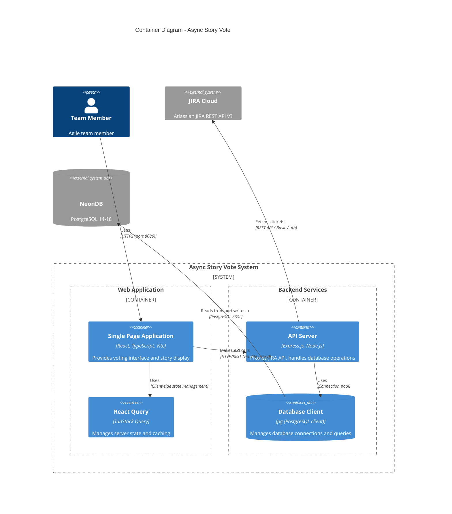

# Architecture Documentation

This document provides C4 model architectural diagrams for the Async Story Vote application.

## C4 Model Overview

The C4 model is a way to visualize software architecture using 4 levels of abstraction:
- **Level 1: System Context** - Shows the system and its relationships with users and external systems
- **Level 2: Container** - Shows the high-level technical building blocks (applications, databases, etc.)
- **Level 3: Component** - Shows the components within a container
- **Level 4: Code** - Shows classes/modules within a component

This document covers Levels 1 and 2.

---

## Level 1: System Context Diagram

The System Context diagram shows the Async Story Vote system and its relationships with users and external systems.



### Description

The **Async Story Vote** system enables team members to vote on story points asynchronously. The system:

- **Interacts with Team Members**: Team members use the web application to view JIRA tickets, cast votes, and see voting results
- **Integrates with JIRA Cloud**: Fetches tickets that need refinement, including descriptions, metadata, and pagination
- **Persists Data in NeonDB**: Stores votes, session state, and team member information (no PII or sensitive data)

### Key Relationships

- **Team Member → Async Story Vote**: Team members access the web application via HTTPS to vote on stories
- **Async Story Vote → JIRA Cloud**: The system fetches tickets using JIRA REST API v3 with Basic Authentication
- **Async Story Vote → NeonDB**: The system persists voting data and session state using PostgreSQL over SSL

---

## Level 2: Container Diagram

The Container diagram shows the high-level technical building blocks that make up the Async Story Vote system.



### Containers

#### 1. Single Page Application (SPA)
- **Technology**: React 18, TypeScript, Vite
- **Purpose**: Provides the user interface for voting, viewing stories, and managing sessions
- **Responsibilities**:
  - Render story cards with rich text descriptions
  - Display voting interface with story point options
  - Show list view with pagination
  - Handle view mode switching (voting vs list)
  - Display unclear flags and vote counts
  - Auto-scroll navigation

#### 2. React Query
- **Technology**: TanStack Query (React Query)
- **Purpose**: Manages server state, caching, and data fetching
- **Responsibilities**:
  - Cache JIRA ticket data (5-minute stale time)
  - Handle loading and error states
  - Manage pagination state
  - Optimistic updates for votes

#### 3. API Server
- **Technology**: Express.js, Node.js
- **Purpose**: Backend API that proxies JIRA requests and handles database operations
- **Responsibilities**:
  - Proxy JIRA API requests (avoids CORS issues)
  - Handle JIRA authentication (Basic Auth)
  - Implement token-based pagination
  - Provide REST endpoints for:
    - `/api/jira/tickets` - Fetch paginated JIRA tickets
    - `/api/sessions/:sessionId/stories` - Save/retrieve stories
    - `/api/sessions/:sessionId/members` - Manage team members
    - `/api/sessions/:sessionId/votes` - Save/retrieve votes
    - `/api/sessions/:sessionId/state` - Save/retrieve session state
  - Handle batch operations for performance
  - Validate and sanitize input data

#### 4. Database Client
- **Technology**: `pg` (node-postgres)
- **Purpose**: Manages PostgreSQL connections and queries
- **Responsibilities**:
  - Connection pooling (max 20 connections)
  - Execute SQL queries with parameterized statements
  - Handle transactions
  - Manage connection lifecycle

### External Systems

#### JIRA Cloud
- **Type**: External REST API
- **Protocol**: HTTPS, REST API v3
- **Authentication**: Basic Auth (email + API token)
- **Endpoints Used**:
  - `/rest/api/3/search/jql` - Search tickets with JQL
- **Data Flow**: Backend fetches tickets, paginates results, returns to frontend

#### NeonDB
- **Type**: Cloud PostgreSQL Database
- **Version**: PostgreSQL 14-18 (default: 17)
- **Protocol**: PostgreSQL over SSL
- **Purpose**: Persistent storage for votes, session state, and metadata
- **Security**: SSL required, no PII stored

### Data Flow

1. **Story Fetching**:
   - User opens application → SPA requests stories → API Server → JIRA Cloud
   - JIRA returns tickets → API Server transforms data → SPA displays stories

2. **Voting**:
   - User votes → SPA sends vote → API Server → Database Client → NeonDB
   - Vote persisted → API confirms → SPA updates UI

3. **Session State**:
   - User navigates → SPA updates state → API Server → Database Client → NeonDB
   - State persisted → Page refresh → SPA restores state from database

### Technology Decisions

- **Frontend Framework**: React chosen for component-based architecture and ecosystem
- **State Management**: React Query for server state, React hooks for local state
- **Backend Framework**: Express.js for simplicity and Node.js ecosystem compatibility
- **Database**: PostgreSQL (NeonDB) for ACID compliance and relational data
- **API Proxy**: Backend proxy avoids CORS issues and centralizes authentication
- **Pagination**: Token-based pagination for efficient JIRA API usage
- **Connection Pooling**: Reduces database connection overhead

### Security Considerations

- **No PII Storage**: Database only stores display names, not emails or user IDs
- **No Sensitive Data**: Task descriptions and titles are never stored
- **SSL Required**: All database connections use SSL
- **API Token Security**: JIRA API tokens stored in environment variables
- **CORS Protection**: Backend proxy prevents direct JIRA API access from browser
- **Input Validation**: Server-side validation for all API inputs

---

## Additional Architecture Notes

### Deployment Architecture

```
┌─────────────────────────────────────────────────────────┐
│                    Production Environment                │
├─────────────────────────────────────────────────────────┤
│                                                           │
│  ┌──────────────┐         ┌──────────────┐             │
│  │   CDN/Edge   │────────▶│  Web Server  │             │
│  │  (Static)    │         │  (SPA Build) │             │
│  └──────────────┘         └──────────────┘             │
│                                                           │
│  ┌──────────────┐         ┌──────────────┐             │
│  │   Browser    │────────▶│  API Server  │             │
│  │   (Client)   │◀────────│  (Express)   │             │
│  └──────────────┘         └──────────────┘             │
│                                 │                        │
│                                 ▼                        │
│                          ┌──────────────┐              │
│                          │   NeonDB      │              │
│                          │  (PostgreSQL) │              │
│                          └──────────────┘              │
│                                                          │
└─────────────────────────────────────────────────────────┘
```

### Development Architecture

```
┌─────────────────────────────────────────────────────────┐
│                 Development Environment                  │
├─────────────────────────────────────────────────────────┤
│                                                           │
│  ┌──────────────┐         ┌──────────────┐             │
│  │   Vite Dev   │────────▶│  Express Dev │             │
│  │   Server     │◀────────│    Server    │             │
│  │  (Port 8080) │         │  (Port 3001) │             │
│  └──────────────┘         └──────────────┘             │
│         │                         │                      │
│         │                         ▼                      │
│         │                  ┌──────────────┐             │
│         │                  │   NeonDB      │             │
│         │                  │  (PostgreSQL)│             │
│         │                  └──────────────┘             │
│         │                                                 │
│         ▼                                                 │
│  ┌──────────────┐                                       │
│  │   Browser    │                                       │
│  │  (Hot Reload)│                                       │
│  └──────────────┘                                       │
│                                                          │
└─────────────────────────────────────────────────────────┘
```

### Key Design Patterns

1. **API Gateway Pattern**: Backend server acts as a gateway, proxying external API calls
2. **Repository Pattern**: Database client abstracts data access logic
3. **Container/Component Pattern**: React components organized hierarchically
4. **Observer Pattern**: React Query observes and caches server state
5. **Batch Processing**: Stories saved in batches for performance

### Scalability Considerations

- **Frontend**: Stateless SPA can be served via CDN
- **Backend**: Stateless API can be horizontally scaled
- **Database**: Connection pooling handles concurrent requests
- **Caching**: React Query caches reduce API calls
- **Pagination**: Token-based pagination handles large datasets efficiently

---

## Related Documentation

- [README.md](../README.md) - Project overview and setup
- [database/README.md](../database/README.md) - Database schema and setup
- [database/schema.sql](../database/schema.sql) - Database schema definition

